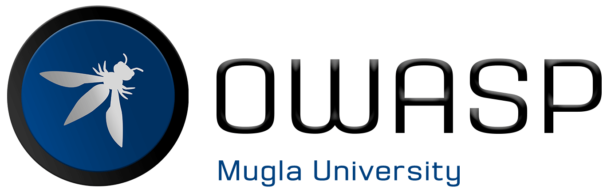

---

layout: col-sidebar
title: OWASP Mugla University - Student Chapter
tags: owaspmsku
region: Asia
meetup-group: owasp-mugla-university-student-chapter

---

## Welcome
Welcome to OWASP Mugla University. We are happy to see you if you participate us!
Muğla Sıtkı Koçman University (MSKU) is one of the most prestigious university in Turkey. As OWASP Mugla University, we organise Meetups, conferences, professional speaker series, workshops and inspiring presentations about Cyber Security. 

## Chapter Information

OWASP Mugla University was established in October 2021 as a Student Chapter. The first meeting was held on 08.11.2021 with the Cyber security fundamentals and introduction of OWASP. Following this meeting, public meetings were held addressing various areas of Cyber Security. As OWASP Mugla University, we continue meetings that focus on content that participants can implement in their own environment, free of charge and open to everyone.

Keep watching this space for announcements about upcoming events. Everyone is welcome to join us at our chapter meetings. For more detailed information about the OWASP Mugla University Student Chapter, contact the chapter leaders: 

* [Furkan Ozturk](mailto:furkan.ozturk@owasp.org)
* [Resul Bozburun](mailto:resul.bozburun@owasp.org)
* [Dr. Enis Karaaslan](mailto:enis.karaaslan@owasp.org)

## Future Meetings 
OWASP Mugla University Student Chapter meetings are posted on our meetup!  [Meetup Group](https://www.meetup.com/owasp-mugla-university-student-chapter/)



Our meetings are open to the public, and you do not need to be a member to attend. Please do consider [joining OWASP](https://owasp.org/membership/) if you find our community, projects, and meetings valuable, or sponsoring this chapter.

## Benefits of Attending Meetings
+ Networking
+ Cyber Security knowledge sharing
+ Gaining different perspectives
+ Have fun!

## Membership
The Open Worldwide Application Security Project (OWASP) is a nonprofit foundation that works to improve the security of software. All of our projects, tools, documents, forums, and chapters are free and open to anyone interested in improving application security. 

Chapters are led by local leaders in accordance with the [Chapters Policy](/www-policy/operational/chapters). Financial contributions should only be made online using the authorized online donation button. 

+ Everyone is welcome and encouraged to participate in our [Projects](/projects/), [Local Chapters](/chapters/), [Events](/events/), [Online Groups](https://groups.google.com/a/owasp.com/), and [Community Slack Channel](https://owasp.slack.com/).We especially encourage diversity in all our initiatives. 
+ OWASP is a fantastic place to learn about application security, to network, and even to build your reputation as an expert. 
+ We also encourage you to be [become a member](/membership/) or consider a [donation](/donate/) to support our ongoing work.

## Supporters

OWASP finances the projects and its organization through sponsors. A sponsor sustainably supports the work of OWASP.
You have two options - which you can also use both in parallel - to support OWASP. We would be very happy about that: 

* Become an [OWASP Corporate Supporter](https://owasp.org/supporters/)
* Support the chapter as an [OWASP Mugla University Student Chapter Supporter](https://owasp.org/donate/?reponame=www-chapter-mugla-university&title=OWASP+Mugla+University+-+Student+Chapter)

In particular, please take note of the [OWASP Donations Policy](https://owasp.org/www-policy/operational/donations).

## Presentations and Professional Speakings
If you like to speak on our upcoming events, please review the [speaker agreement](https://owasp.org/www-policy/legal/speaker-agreement) and kindly email us [Resul Bozburun](mailto://resul.bozburun@owasp.org), [Furkan Ozturk](mailto://furkan.ozturk@owasp.org) & [Dr. Enis Karaarslan](mailto://enis.karaarslan@mu.edu.tr)
